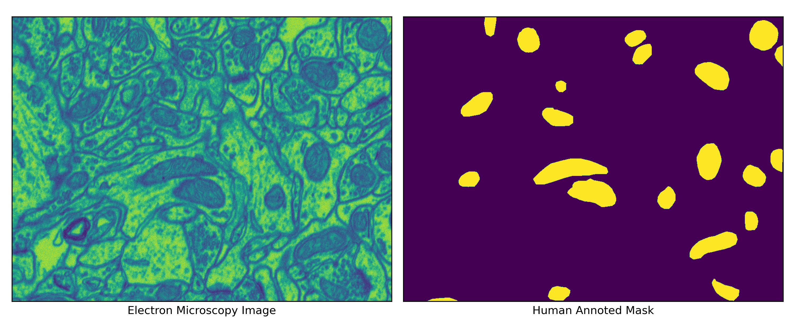

## Abstract

Generative Adversarial Networks (GANs) play a pivotal role in various
applications, and one of their prominent uses is generating synthetic
data. Recent studies have revealed the capability to generate a complete
high-resolution electron microscopy image of mitochondria. The
mitochondrial and cell membrane mask is crucial in recreating the images
using the GANs. This study explores the transfer learning procedures to
generate the cell membrane mask for the dataset where no such mask is
available, using deep learning models trained on different electron
microscopy datasets. Furthermore, the research entails training a
Generative Adversarial Network (GAN) model to generate synthetic images
by predicting masks through transfer learning. Subsequently, the
research will evaluate the performance of U-Net in the mitochondria
segmentation task by augmenting these synthetic data with authentic
images.

## Introduction

For medical image segmentation tasks, U-Net is a well-established
convolutional model. While these models need thousands of data for
training purposes, data scarcity is a major issue regarding biomedical
images. Ronneberger, Fischer, and Brox (2015) used significant data
augmentation to address this issue. This involved applying elastic
deformations to the existing training images. By doing so, the network
acquired invariance to these deformations without requiring exposure to
these transformations in the annotated image corpus. This is especially
crucial in biomedical segmentation as deformation has historically been
a prevalent variation in tissue and realistic deformations can be
effectively simulated. The significance of data augmentation for
developing invariance has been demonstrated in the work of Dosovitskiy
et al. (2014), specifically within the context of unsupervised feature
learning.

Focusing on data augmentation and generating images are other ways for
data augmentation. In recent years, Generative Adversarial Nets (GANs)
have shown promising results in generating medical images. (Bowles et
al. (2018), Middel, Palm, and Erdt (2019))

In this work, we are using data augmentation by generating
realistic-looking images through Generative Adversarial Nets(GANs) and
see the segmentation performance of U-Net.

## Dataset (CA1 Hippocampus)

This is a electron microscopy dataset taken from the CA1 hippocampus
region of the brain(dataset 1). This dataset contains 165 images of
dimension 768x1024 along with Human annotated mask for the mitochondria.

<figure>

<figcaption aria-hidden="true">Side by side comparison of the image
under microscope (CA1 Hippocampus) and human annoted mask.</figcaption>
</figure>

In the work of Han, Murphy, and Ramanan (2018), it has been shown that
the mitochondrial mask itself is not capable of providing a realistic
looking electron microscopy image. Additional mask of cell membrane is
required to generate a realistic looking image. However this dataset the
human annotated cell membrane dataset is not available. So to generate
realistic looking electron microscopy images for CA1 Hippocampus
retrieving the mask for the the cell membrane is required.

## Dataset (Drosophilla)

This dataset (dataset 2) only contains 20 images of 1024x1024 resolution
with corresponding human annotated mitochondria and cell membrane mask.
A standard U-Net neural network has been fitted on this dataset where
the input of the model is the electron microscopy image and the
mitochondrial mask. The output of the model is the cell membrane mask.
The main goal of this model to be trained is to predict the cell
membrane mask for the CA1 Hippocampus electron microscopy dataset.

<figure>

<figcaption aria-hidden="true">Side by side comparison of the image
under microscope (Drosophilla) and human annoted mask. The electron
microscopy image (left image) and the mitocondrial mask (portion of the
right image annoted in red color) are the input. The mitocondrial mask
is the output (portion of the right image annoted in green
color)</figcaption>
</figure>

## Transfer Learning For cell Membrane.

The main challenge was the different data distribution between the
electron microscopy image of Drosophilla Larva and CA1 Hippocampus. The
color profile of the image differ greatly with different level of
brightness and contrast. To make the transfer learning of the model more
robust so that the train model on the Drosophilla Larva dataset (dataset
2) can able to predict the cell membrane of the CA1 Hippocampus electron
microscopy dataset. So a significant amount of Gaussian noise has been
introduced while training with the import channel. This methods works
really well. The model can identify the cell membrane for the CA1
Hippocampus electron microscopy dataset. Though there is no way to
evaluate the performance with a numerical quantity because the human
annotated cell membrane mask is not available for the CA1 Hippocampus
electron microscopy dataset, the performance can be evaluate by the
eyes. In figure 3, the predicted cell membrane has been shown side by
side with the corresponding electron microscopy images. The performance
of the model in the trained dataset is quiet well where as the
performance is not that good for the CA1 Hippocampus electron microscopy
dataset (transfer learning has been used to predict the cell membrane
and the model did not see any images from this dataset in the training
time) compare to the Drosophilla Larva dataset, the performance is good
enough in general.

<figure>

<figcaption aria-hidden="true">Side by side comparison of the image
under microscope and human annoted mask.</figcaption>
</figure>

## Methodology

The findings of Isola et al. (2017) indicate that conditional
adversarial networks are an effective approach for various
image-to-image translation tasks, particularly when dealing with outputs
that exhibit highly structured graphical elements, called pix-to-pix
GAN. For our project, we are using the Electron Microscopy dataset. In
that dataset, we have an image and corresponding mitochondria mask. We
have trained our model, giving the mitochondria mask as an input and
predicting the corresponding image as an output. Only conditioning on
the mitochondria mask generated images, but only the mitochondria
portion, not the details of the images. To generate more
realistic-looking images, an additional conditioning mask of a cell
membrane is suggested to give more accurate images following the works
of Han, Murphy, and Ramanan (2018), who used another EM dataset to
generate image conditioning on cell membranes and mitochondria masks.
Since our dataset does not have a cell membrane mask, with transfer
learning, we generated a cell membrane mask training a U-Net mode to
predict the cell membrane mask, giving mitochondria mask and
corresponding image as input.

## Generative Adversarial Network (GAN)

Generator: As a generator we are using the U-Net architecture with
slight modification as described in the paper of Isola et al. (2017) to
the main U-Net architecture. Here is the basic architecture of the U-Net
model.

Where, *C**K* denotes the Convolution-InstanceNorm-ReLU layer with k
filters and *C**D**K* denotes a Convolution-InstanceNorm-Dropout-ReLU
layer with a dropout rate of All convolutions are 4 × 4 spatial filters
applied with stride 2. Convolutions in the encoder, and in the
discriminator, downsample by a factor of 2, whereas in the decoder they
upsample by a factor of 2. 50% rate of dropout has been used.

Discriminator: Three discriminator has been used. Each of the patch of
size 70x70. In the first discriminator full size image of 256x256
dimension has provided. In the second discriminator a resized image of
128x128 dimension has provided. Lastly in the third discriminator a
resized image of 64x64 dimension has provided. The architecture of the
discriminator has set up to
*C*64 − *C*128 − *C*256 − *C*512

## Generated The Synthetic Images

A generative adversarial network has been used conditions on the mask of
the mitochondria and the cell membrane on the Drosophilla Larva dataset
to generate a synthetic electron microscopy image. The image quality are
lacks in details (Figure 4). To introduce more details the work on the
discriminator part is in progress. If the details has been considered
that the generated image is preserved the structure of the overall cell.

<figure>

<figcaption aria-hidden="true">Generated images for the Drosophilla
Larva dataset.</figcaption>
</figure>

## Generated The Synthetic Images

Now, to generate synthetic image, we trained a pix-to-pix GAN Model and
generated synthetic images for the dataset 1. To generate realistic
looking images, we want to provide mitochondria and cell membrane masks
as input. The cell membrane mask are generated using transfer learning
for this dataset. So the input of the generator of the model is the
generated cell membrane mask and the mitochondrial mask. On the other
side the output of the model is the image of the electron microscopy
dataset (Figure 5). The overall images are not that much realistic. The
architecture sde on the pip-to-pix gan need to be revised to extarct the
optimal performance.

<figure>

<figcaption aria-hidden="true">Generated images for CA1 Hippocampus
dataset.</figcaption>
</figure>

## Work in progress

To get more details inside the image we will be working with different
GAN models following the works of Han, Murphy, and Ramanan (2018). After
that we will see segmentation performance training U-Net model with
synthetic data augmentation.

## Referances

Bowles, Christopher, Liang Chen, Ricardo Guerrero, Paul Bentley, Roger
Gunn, Alexander Hammers, David Alexander Dickie, Maria Valdés Hernández,
Joanna Wardlaw, and Daniel Rueckert. 2018. “Gan Augmentation: Augmenting
Training Data Using Generative Adversarial Networks.” *arXiv Preprint
arXiv:1810.10863*.

Dosovitskiy, Alexey, Jost Tobias Springenberg, Martin Riedmiller, and
Thomas Brox. 2014. “Discriminative Unsupervised Feature Learning with
Convolutional Neural Networks.” *Advances in Neural Information
Processing Systems* 27.

Han, Ligong, Robert F Murphy, and Deva Ramanan. 2018. “Learning
Generative Models of Tissue Organization with Supervised GANs.” In *2018
IEEE Winter Conference on Applications of Computer Vision (WACV)*,
682–90. IEEE.

Isola, Phillip, Jun-Yan Zhu, Tinghui Zhou, and Alexei A Efros. 2017.
“Image-to-Image Translation with Conditional Adversarial Networks.” In
*Proceedings of the IEEE Conference on Computer Vision and Pattern
Recognition*, 1125–34.

Middel, Luise, Christoph Palm, and Marius Erdt. 2019. “Synthesis of
Medical Images Using Gans.” In *Uncertainty for Safe Utilization of
Machine Learning in Medical Imaging and Clinical Image-Based Procedures:
First International Workshop, UNSURE 2019, and 8th International
Workshop, CLIP 2019, Held in Conjunction with MICCAI 2019, Shenzhen,
China, October 17, 2019, Proceedings 8*, 125–34. Springer.

Ronneberger, Olaf, Philipp Fischer, and Thomas Brox. 2015. “U-Net:
Convolutional Networks for Biomedical Image Segmentation.” In *Medical
Image Computing and Computer-Assisted Intervention–MICCAI 2015: 18th
International Conference, Munich, Germany, October 5-9, 2015,
Proceedings, Part III 18*, 234–41. Springer.
