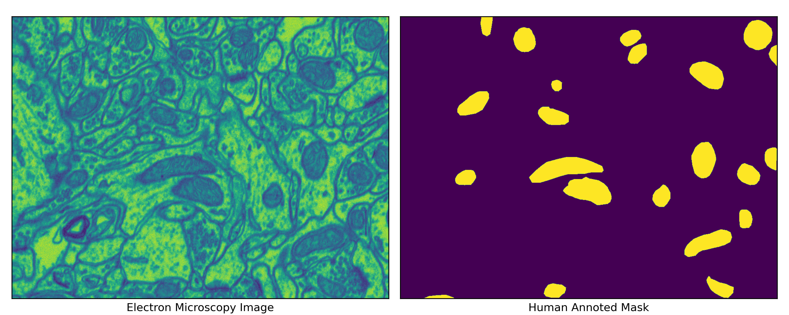

```{r setup, include=FALSE}
knitr::opts_chunk$set(echo = TRUE)
library(tidyverse)
```

## Abstract

Generative Adversarial Networks (GANs) play a pivotal role in various applications, and one of their prominent uses is generating synthetic data. Recent studies have revealed the capability to generate a complete high-resolution electron microscopy image of mitochondria. The mitochondrial and cell membrane mask is crucial in recreating the images using the GANs. This study explores the transfer learning procedures to generate the cell membrane mask for the dataset where no such mask is available, using deep learning models trained on different electron microscopy datasets. Furthermore, the research entails training a Generative Adversarial Network (GAN) model to generate synthetic images by predicting masks through transfer learning. Subsequently, the research will evaluate the performance of U-Net in the mitochondria segmentation task by augmenting these synthetic data with authentic images.

## Introduction

For medical image segmentation tasks, U-Net is a well-established convolutional model. While these models need thousands of data for training purposes, data scarcity is a major issue regarding biomedical images. @ronneberger2015u used significant data augmentation to address this issue. This involved applying elastic deformations to the existing training images. By doing so, the network acquired invariance to these deformations without requiring exposure to these transformations in the annotated image corpus. This is especially crucial in biomedical segmentation as deformation has historically been a prevalent variation in tissue and realistic deformations can be effectively simulated. The significance of data augmentation for developing invariance has been demonstrated in the work of @dosovitskiy2014discriminative, specifically within the context of unsupervised feature learning.


Focusing on data augmentation and generating images are other ways for data augmentation. In recent years, Generative Adversarial Nets (GANs) have shown promising results in generating medical images. (@bowles2018gan, @middel2019synthesis)

In this work, we are using data augmentation by generating realistic-looking images through Generative Adversarial Nets(GANs) and see the segmentation performance of U-Net.


\newpage

## Dataset (CA1 Hippocampus)
This is a electron microscopy dataset taken from the CA1 hippocampus region of the brain(dataset 1). This dataset contains 165 images of dimension 768x1024 along with Human annotated mask for the mitochondria.



In the work of @han2018learning, it has been shown that the mitochondrial mask itself is not capable of providing a realistic looking electron microscopy image. Additional mask of cell membrane is required to generate a realistic looking image. However this dataset the human annotated cell membrane dataset is not available. So to generate realistic looking electron microscopy images for CA1 Hippocampus retrieving the mask for the the cell membrane is required. 

## Dataset (Drosophilla)
This dataset (dataset 2) only contains 20 images of 1024x1024 resolution with corresponding human annotated mitochondria and cell membrane mask. A standard U-Net neural network has been fitted on this dataset where the input of the model is the electron microscopy image and the mitochondrial mask. The output of the model is the cell membrane mask. The main goal of this model to be trained is to predict the cell membrane mask for the CA1 Hippocampus electron microscopy dataset.


## Transfer Learning For cell Membrane.

The main challenge was the different data distribution between the electron microscopy image of Drosophilla Larva and CA1 Hippocampus. The color profile of the image differ greatly with different level of brightness and contrast. To make the transfer learning of the model more robust so that the train model on the Drosophilla Larva dataset (dataset 2) can able to predict the cell membrane of the CA1 Hippocampus electron microscopy dataset. So a significant amount of Gaussian noise has been introduced while training with the import channel. This methods works really well. The model can identify the cell membrane for the CA1 Hippocampus electron microscopy dataset. Though there is no way to evaluate the performance with a numerical quantity because the human annotated cell membrane mask is not available for the CA1 Hippocampus electron microscopy dataset, the performance can be evaluate by the eyes. In figure 3, the predicted cell membrane has been shown side by side with the corresponding electron microscopy images. The performance of the model in the trained dataset is quiet well where as the performance is not that good for the CA1 Hippocampus electron microscopy dataset (transfer learning has been used to predict the cell membrane and the model did not see any images from this dataset in the training time) compare to the Drosophilla Larva dataset, the performance is good enough in general.


## Methodology

The findings of @isola2017image indicate that conditional adversarial networks are an effective approach for various image-to-image translation tasks, particularly when dealing with outputs that exhibit highly structured graphical elements, called pix-to-pix GAN. For our project, we are using the Electron Microscopy dataset. In that dataset, we have an image and corresponding mitochondria mask.  We have trained our model, giving the mitochondria mask as an input and predicting the corresponding image as an output. Only conditioning on the mitochondria mask generated images, but only the mitochondria portion, not the details of the images. To generate more realistic-looking images, an additional conditioning mask of a cell membrane is suggested to give more accurate images following the works of 	@han2018learning, who used another EM dataset to generate image conditioning on cell membranes and mitochondria masks. Since our dataset does not have a cell membrane mask, with transfer learning, we generated a cell membrane mask training a U-Net mode to predict the cell membrane mask, giving mitochondria mask and corresponding image as input.


## Generative Adversarial Network (GAN)

Generator: As a generator we are using the U-Net architecture with slight modification as described in the paper of @isola2017image  to the main U-Net architecture. Here is the basic architecture of the U-Net model.


\begin{align*}
Encoder:&C64-C128-C256-C512-C512-C512-C512-C512\\
Decoder:&CD512-CD1024-CD1024-C1024-C1024-C512-C256-C128
\end{align*}


Where, $CK$ denotes the Convolution-InstanceNorm-ReLU layer with k filters and $CDK$ denotes a Convolution-InstanceNorm-Dropout-ReLU layer with a dropout rate of All convolutions are 4 × 4 spatial filters applied with stride 2. Convolutions in the encoder, and in the discriminator, downsample by a factor of 2, whereas in the decoder they upsample by a factor of 2. 50% rate of dropout has been used.

Discriminator: Three discriminator has been used. Each of the patch of size 70x70. In the first discriminator full size image of 256x256 dimension has provided. In the second discriminator a resized image of 128x128 dimension has provided. Lastly in the third discriminator a resized image of 64x64 dimension has provided. The architecture of the discriminator has set up to
$$
C64-C128-C256-C512
$$


## Generated The Synthetic Images

A generative adversarial network has been used conditions on the mask of the mitochondria and the cell membrane on the Drosophilla Larva dataset to generate a synthetic electron microscopy image. The image quality are lacks in details (Figure 4). To introduce more details the work on the discriminator part is in progress. If the details has been considered that the generated image is preserved the structure of the overall cell. 


## Generated The Synthetic Images

Now, to generate synthetic image, we trained a pix-to-pix GAN Model and generated synthetic images for the dataset 1. To generate realistic looking images, we want to provide mitochondria and cell membrane masks as input. The cell membrane mask are generated using transfer learning for this dataset. So the input of the generator of the model is the generated cell membrane mask and the mitochondrial mask. On the other side the output of the model is the image of the electron microscopy dataset (Figure 5). The overall images are not that much realistic. The architecture sde on the pip-to-pix gan need to be revised to extarct the optimal performance.


## Work in progress

To get more details inside the image we will be working with different GAN models following the works of 	@han2018learning. After that we will see segmentation performance training U-Net model with synthetic data augmentation.

\newpage
## Referances


